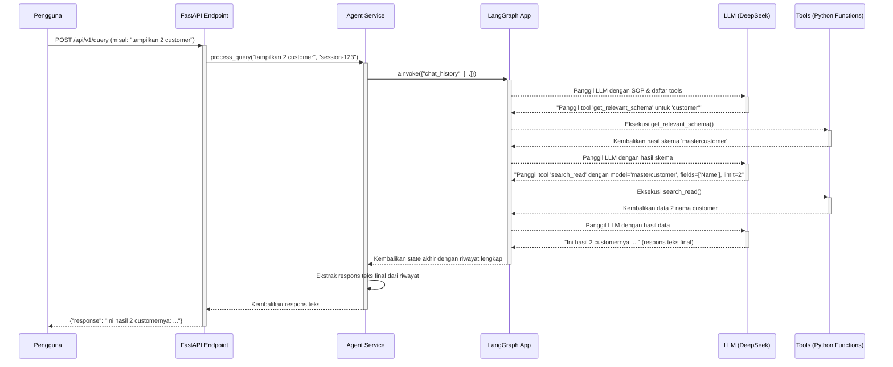

### **Dokumen Memori Proyek: Fase Database**
**Versi:** 1.0
**Tanggal:** 11 Juni 2025

#### **1. Instruksi untuk LLM Pengguna Dokumen Ini**
*   **Peran Anda:** Anda adalah AI Engineer yang melanjutkan proyek ini. Dokumen ini adalah sumber kebenaran utama Anda.
*   **Tugas Anda:**
    1.  Baca dan pahami seluruh dokumen ini untuk mendapatkan konteks penuh tentang apa yang telah dibangun.
    2.  Saat pengguna meminta Anda untuk memulai tugas baru (misal: "lanjutkan ke fase backend" atau "revisi fitur X"), **jangan langsung menulis kode**.
    3.  Tugas pertama Anda adalah **menganalisis permintaan tersebut dan membuat daftar file spesifik** yang Anda perlukan untuk menyelesaikan tugas itu. Gunakan "Peta File & Direktori" di bawah sebagai referensi.
    4.  Berikan daftar file yang Anda butuhkan kepada pengguna. Setelah pengguna memberikan isi dari file-file tersebut, barulah Anda boleh mulai menganalisis dan menulis kode.
*   **Panduan Revisi:** Saat melakukan revisi, selalu rujuk ke "Log Pembelajaran & Keputusan Desain" untuk memahami mengapa keputusan tertentu dibuat. Jika Anda mengusulkan perubahan, jelaskan dampaknya terhadap komponen lain berdasarkan "Diagram Ketergantungan Komponen".

#### **2. Ringkasan Fase & Status Saat Ini**
*   **Fase yang Didokumentasikan:** Database
*   **Tujuan Utama Fase Ini:** Membangun dan memvalidasi fondasi data yang terdiri dari database operasional MySQL (`sim_testgeluran`) dan *knowledge graph* Neo4j (`Graphiti`).
*   **Status Akhir:** SELESAI. Semua komponen database telah dibangun, diisi dengan data sampel, dan divalidasi secara end-to-end. Fondasi data siap untuk digunakan oleh backend.
*   **Komponen Utama yang Dihasilkan:**
    *   Database MySQL `sim_testgeluran` (untuk dev) & `sim_testgeluran_test` (untuk tes) yang skemanya sinkron dengan model ORM.
    *   Knowledge Graph Neo4j yang terisi dengan skema dan metadata semantik dari database MySQL.
    *   Serangkaian skrip utilitas untuk inisialisasi, validasi, dan migrasi skema.

#### **3. Peta File & Direktori yang Relevan**
*   **Struktur Direktori:**
    ```
    ai_agent_project_root/
    |
    ├── .env
    |
    ├── backend/
    │   ├── app/
    │   │   └── core/
    │   │       └── config.py
    │   └── mcp_servers/
    │       └── mysql_server/
    │           ├── alembic/
    │           │   ├── versions/
    │           │   │   └── xxxxx_initial_schema_from_models.py
    │           │   └── env.py
    │           ├── db_models/
    │           │   ├── __init__.py
    │           │   ├── base.py
    │           │   └── orm_*.py
    │           └── alembic.ini
    |
    ├── data_samples/
    │   ├── data.sql
    │   ├── graphiti_semantic_mapping.json
    │   └── schema_export.txt
    │
    └── scripts/
        ├── initialize_db_mysql.py
        ├── sync_mysql_to_graphiti.py
        └── validate_orm_models.py
    ```
*   **Deskripsi File Kunci:**
    *   `backend/mcp_servers/mysql_server/db_models/orm_*.py`: Mendefinisikan setiap tabel database sebagai kelas Python menggunakan SQLAlchemy ORM. Ini adalah "cetak biru" digital dari database.
    *   `backend/mcp_servers/mysql_server/db_models/__init__.py`: Mengimpor semua kelas ORM agar dapat diakses sebagai satu paket (`db_models`).
    *   `data_samples/schema_export.txt`: Referensi tekstual dari skema database asli. Digunakan untuk validasi manual terhadap model ORM.
    *   `data_samples/data.sql`: Berisi perintah SQL `INSERT` untuk mengisi database development dengan data sampel yang representatif dan konsisten.
    *   `scripts/initialize_db_mysql.py`: Skrip untuk membuat skema database dari model ORM dan mengisinya dengan data dari `data.sql`.
    *   `scripts/validate_orm_models.py`: Skrip pengujian untuk memvalidasi model ORM (CRUD) terhadap database tes yang bersih.
    *   `data_samples/graphiti_semantic_mapping.json`: "Otak" dari *knowledge graph*. File JSON ini memperkaya skema teknis dengan konteks bisnis (tujuan tabel, klasifikasi kolom, relasi).
    *   `scripts/sync_mysql_to_graphiti.py`: Skrip yang membaca pemetaan semantik dan membangun *knowledge graph* di Neo4j.
    *   `backend/mcp_servers/mysql_server/alembic/`: Direktori yang berisi konfigurasi dan skrip migrasi Alembic untuk mengelola perubahan skema database di masa depan.

#### **4. Diagram Ketergantungan Komponen**
*   **Deskripsi:** Aliran kerja dan ketergantungan antar file dalam fase ini.
    *   `schema_export.txt` -> menjadi acuan untuk -> `orm_*.py`.
    *   `orm_*.py` -> dibaca oleh -> `scripts/validate_orm_models.py` -> untuk menguji -> **Database Tes MySQL**.
    *   `orm_*.py` + `data.sql` -> digunakan oleh -> `scripts/initialize_db_mysql.py` -> untuk mengisi -> **Database Dev MySQL**.
    *   `graphiti_semantic_mapping.json` -> digunakan oleh -> `scripts/sync_mysql_to_graphiti.py` -> untuk mengisi -> **Database Neo4j**.
    *   `orm_*.py` -> dibaca oleh -> `alembic` -> untuk membuat skrip migrasi skema.
    *   `.env` -> dibaca oleh -> `backend/app/core/config.py` -> digunakan oleh -> semua skrip di atas.

#### **5. Log Pembelajaran & Keputusan Desain**
*   **Deskripsi:** Catatan tentang masalah yang dihadapi, solusi yang diterapkan, dan keputusan desain penting yang dibuat selama fase ini.
*   **Daftar Pelajaran:**
    *   **Masalah 1:** `ImportError: cannot import name 'Arbook'`.
        *   **Penyebab:** File `db_models/__init__.py` tidak secara eksplisit mengekspos kelas-kelas ORM.
        *   **Solusi:** Merevisi `__init__.py` untuk secara eksplisit mengimpor semua model (`from .orm_a_e import *`, dst.). Ini adalah praktik standar untuk membuat paket Python yang isinya dapat diakses dari luar.
    *   **Masalah 2:** `IntegrityError: a foreign key constraint fails`.
        *   **Penyebab:** Mencoba memasukkan data "anak" (`Mastercustomer`) sebelum data "induk" (`Masterpricelisttype`) ada di database.
        *   **Solusi:** Merevisi skrip validasi dan `data.sql` untuk memastikan data master/induk dibuat terlebih dahulu. Ini menekankan pentingnya urutan dalam *seeding* data relasional.
    *   **Masalah 3:** `DataError: Data too long for column`.
        *   **Penyebab:** Data sampel (misal: `'RETAIL'`) tidak sesuai dengan batasan skema (`VARCHAR(5)`).
        *   **Solusi:** Selalu validasi data sampel terhadap skema yang sebenarnya (`schema_export.txt`). Mengubah data agar sesuai (misal: menjadi `'RTL'`).
    *   **Masalah 4:** `TypeError` & `AttributeError` saat menjalankan Alembic.
        *   **Penyebab:** Kesalahan konfigurasi pada file `alembic/env.py` dalam meneruskan `target_metadata` dan URL database ke *context* Alembic.
        *   **Solusi:** Memperbaiki cara `context.configure()` dan `engine_from_config()` dipanggil untuk memastikan konfigurasi dari `config.py` digunakan dengan benar.
    *   **Keputusan Desain 1:** Menggunakan Alembic untuk Manajemen Skema.
        *   **Alasan:** Untuk mengelola evolusi skema di masa depan secara terprogram dan aman, menghindari perubahan manual yang berisiko. Ini adalah praktik terbaik industri.
    *   **Keputusan Desain 2:** Inisialisasi Database Berbasis ORM (`Base.metadata.create_all`).
        *   **Alasan:** Menggunakan model ORM sebagai satu-satunya sumber kebenaran (Single Source of Truth) untuk struktur database, bukan file `.sql`. Ini menjamin sinkronisasi 100% antara kode aplikasi dan skema database.

---


### **Dokumen Memori Proyek: Fase Backend**
**Versi:** 1.0
**Tanggal:** 12 Juni 2025

### **Bab 1: Arsitektur Backend & Alur Kerja Tool Calling**

#### **1. Instruksi untuk LLM Pengguna Dokumen Ini**
*   **Peran Anda:** Anda adalah AI Engineer yang melanjutkan proyek ini. Dokumen ini adalah sumber kebenaran utama Anda.
*   **Tugas Anda:**
    1.  Baca dan pahami seluruh dokumen ini untuk mendapatkan konteks penuh tentang apa yang telah dibangun.
    2.  Saat pengguna meminta Anda untuk memulai tugas baru, tugas pertama Anda adalah menganalisis permintaan tersebut dan membuat daftar file spesifik yang Anda perlukan untuk menyelesaikan tugas itu, berdasarkan "Peta File & Direktori" di bab berikutnya.
    3.  Setelah pengguna memberikan file-file yang relevan, barulah Anda boleh mulai menganalisis dan menulis kode.
*   **Panduan Revisi:** Rujuk ke dokumen ini untuk memahami arsitektur dan alur kerja saat ini sebelum melakukan perubahan.

#### **2. Ringkasan Arsitektur**
Arsitektur backend final untuk MVP ini dirancang dengan prinsip **kesederhanaan dan keandalan**. Setelah melalui beberapa iterasi (termasuk membatalkan pendekatan `DatabaseOperationPlan` yang kompleks), diputuskan untuk mengadopsi arsitektur proses tunggal yang menggunakan pola **`search_read` yang terinspirasi dari Odoo**.

Sistem ini terdiri dari tiga lapisan utama yang berjalan dalam satu aplikasi FastAPI:
1.  **Lapisan API (FastAPI):** Bertindak sebagai gerbang masuk untuk semua permintaan dari klien (frontend).
2.  **Lapisan Layanan (Agent Service):** Berfungsi sebagai jembatan, menerima data dari API, mengelola memori percakapan, dan mengorkestrasi alur kerja agent.
3.  **Lapisan Agent (LangGraph):** Merupakan inti dari sistem. Ini adalah sebuah *state machine* yang secara dinamis memutuskan apakah perlu memanggil LLM untuk "berpikir" atau memanggil *tool* Python untuk "bertindak" (misalnya, `get_relevant_schema` atau `search_read`).

Pendekatan ini menghilangkan kerumitan komunikasi antar-proses dan memungkinkan debugging yang lebih mudah, sambil tetap mempertahankan pemisahan logika yang baik dengan menempatkan semua *tool* dalam direktori khusus.

#### **3. Diagram Alur Kerja**
Diagram berikut mengilustrasikan siklus hidup sebuah permintaan dalam arsitektur `search_read` kita:



#### **4. Deskripsi Komponen Inti**

*   **FastAPI App (`main.py`, `endpoints/query.py`):**
    *   Bertanggung jawab untuk mengekspos endpoint HTTP (`/session/start`, `/query`).
    *   Hanya menangani validasi request/response dan mendelegasikan semua logika bisnis ke `Agent Service`.

*   **Agent Service (`services/agent_service.py`):**
    *   Perantara antara dunia HTTP dan dunia agent.
    *   **Mengelola Memori:** Menggunakan *dictionary* Python sederhana (`conversation_memory`) untuk menyimpan dan mengambil riwayat percakapan untuk setiap `session_id`.
    *   **Menyuntikkan Konteks:** Memastikan `SYSTEM_PROMPT` disisipkan di awal setiap percakapan baru.
    *   **Mengorkestrasi LangGraph:** Memanggil `langgraph_app.ainvoke()` dan mengekstrak respons teks final yang akan dikirim kembali ke pengguna.

*   **LangGraph App (`langgraph_workflow/graph.py`):**
    *   Ini adalah "papan sirkuit" dari agent.
    *   Menggunakan `StateGraph` dengan *state* yang dikelola secara manual (`AgentState`) untuk mendefinisikan *state machine* dua-node yang sangat efisien:
        1.  **`agent` (node `llm_caller`):** Bertugas memanggil LLM.
        2.  **`action` (node `tool_executor`):** Bertugas menjalankan *tool* Python.
    *   Mengelola alur bolak-balik antara "berpikir" (`agent`) dan "bertindak" (`action`) hingga tugas selesai.

*   **Direktori `tools/` (`database_tools.py`, `graphiti_tools.py`):**
    *   Ini adalah "kotak perkakas" dari agent.
    *   Berisi fungsi-fungsi Python biasa yang didekorasi sebagai *tool* dan melakukan tugas-tugas spesifik (query database, query Neo4j).
    *   **`get_relevant_schema()`**: Digunakan untuk mendapatkan "peta data".
    *   **`search_read()`**: Tool utama yang terinspirasi Odoo untuk mengambil data, menggunakan `DynamicQueryBuilder` secara internal untuk menerjemahkan parameter (`domain`, `fields`) menjadi query SQLAlchemy yang aman.

---

### **Bab 2: Peta File & Komponen Kunci**

#### **1. Instruksi untuk LLM Pengguna Dokumen Ini**
*   **Peran Anda:** Anda adalah AI Engineer yang melanjutkan proyek ini. Dokumen ini adalah sumber kebenaran utama Anda.
*   **Tugas Anda:**
    1.  Baca dan pahami seluruh dokumen ini untuk mendapatkan konteks penuh tentang apa yang telah dibangun.
    2.  Saat pengguna meminta Anda untuk memulai tugas baru, tugas pertama Anda adalah menganalisis permintaan tersebut dan membuat daftar file spesifik yang Anda perlukan untuk menyelesaikan tugas itu, berdasarkan "Peta File & Direktori" ini.
    3.  Setelah pengguna memberikan file-file yang relevan, barulah Anda boleh mulai menganalisis dan menulis kode.
*   **Panduan Revisi:** Rujuk ke dokumen ini untuk memahami arsitektur dan alur kerja saat ini sebelum melakukan perubahan.

#### **2. Struktur Folder Final (Arsitektur `search_read`)**
Struktur folder ini mencerminkan arsitektur akhir yang telah divalidasi dan terbukti berfungsi, di mana semua logika berada dalam satu aplikasi backend.

```
backend/
└── app/
    ├── api/
    │   └── v1/
    │       └── endpoints/
    │           └── query.py
    ├── core/
    │   └── config.py
    ├── db_models/
    │   ├── __init__.py
    │   ├── base.py
    │   └── (file-file orm_*.py)
    ├── langgraph_workflow/
    │   ├── graph.py
    │   ├── prompts.py
    │   └── nodes/
    │       ├── __init__.py
    │       ├── llm_caller.py
    │       ├── log_analytics.py
    │       └── tool_executor.py
    ├── schemas/
    │   └── agent_state.py
    ├── services/
    │   └── agent_service.py
    ├── tools/
    │   ├── __init__.py
    │   ├── database_tools.py
    │   └── graphiti_tools.py
    └── main.py
```

#### **3. Deskripsi File & Komponen Kunci**

*   **`main.py` & `api/v1/endpoints/query.py`**: Pintu Gerbang API
    *   **Peran:** Mengekspos endpoint HTTP ke dunia luar.
    *   **File Kunci & Fungsinya:**
        *   `main.py`: Menginisialisasi aplikasi FastAPI, mengkonfigurasi CORS, dan menyertakan router dari `query.py`.
        *   `query.py`:
            *   `GET /session/start`: Membuat `session_id` baru dan mereset memori percakapan untuk sesi tersebut.
            *   `POST /query`: Menerima `user_query` dan `session_id`, mendelegasikannya ke `agent_service`, dan mengembalikan respons final.

*   **`services/agent_service.py`**: Orkestrator & Pengelola Memori
    *   **Peran:** Jembatan antara lapisan API dan lapisan Agent.
    *   **File Kunci & Fungsinya:**
        *   `agent_service.py`:
            *   `conversation_memory`: Sebuah `dict` Python yang berfungsi sebagai memori jangka pendek, menyimpan `chat_history` untuk setiap `session_id`. **Penting: Memori ini akan hilang jika server di-restart.**
            *   `process_query()`: Fungsi inti yang:
                1.  Mengambil/menginisialisasi `chat_history` dari `conversation_memory`.
                2.  Menyuntikkan `SYSTEM_PROMPT` jika ini adalah pesan pertama.
                3.  Memanggil `langgraph_app.ainvoke()` untuk menjalankan seluruh alur kerja.
                4.  Menyimpan kembali `chat_history` yang sudah diperbarui.
                5.  Mengekstrak respons teks final yang relevan dari `chat_history` untuk dikembalikan ke API.
                6.  Memanggil `log_analytics_node` secara manual di akhir untuk mencatat telemetri.

*   **`langgraph_workflow/prompts.py`**: "SOP" untuk Agent
    *   **Peran:** Mendefinisikan `SYSTEM_PROMPT`.
    *   **File Kunci & Fungsinya:**
        *   `prompts.py`: Berisi sebuah string panjang (`SYSTEM_PROMPT`) yang berisi instruksi sangat detail bagi LLM. Ini adalah komponen paling kritis yang mengatur perilaku agent. Isinya memaksa agent untuk mengikuti alur: **1. Panggil `get_relevant_schema` -> 2. Buat parameter untuk `search_read` -> 3. Panggil `search_read`**.

*   **`langgraph_workflow/graph.py` & `nodes/`**: Papan Sirkuit Agent
    *   **Peran:** Merakit `StateGraph` dari LangGraph dan mendefinisikan logika setiap langkahnya.
    *   **File Kunci & Fungsinya:**
        *   `graph.py`: Merakit `StateGraph` dengan alur 2-node (`agent` dan `action`) dan mengatur logika kondisional (`should_continue`) untuk memutuskan kapan harus memanggil `tool` atau mengakhiri alur.
        *   `nodes/llm_caller.py`: Bertanggung jawab untuk semua interaksi dengan LLM (DeepSeek), termasuk mengirim `chat_history` dan `tools_definition`.
        *   `nodes/tool_executor.py`: Bertanggung jawab untuk mengeksekusi fungsi Python (`tool`) yang diminta oleh LLM.
        *   `nodes/log_analytics.py`: Mengumpulkan metrik dari state akhir dan menuliskannya ke `logs/analytics.log`.

*   **`tools/`**: Kotak Perkakas Agent
    *   **Peran:** Menyediakan fungsi-fungsi Python yang bisa dipanggil oleh LLM untuk berinteraksi dengan dunia luar (database, Neo4j).
    *   **File Kunci & Fungsinya:**
        *   `database_tools.py`:
            *   `search_read()`: Tool utama yang terinspirasi Odoo. Menerima parameter seperti `model`, `domain`, `fields`, lalu menggunakan `DynamicQueryBuilder` untuk membuat dan mengeksekusi query SQLAlchemy yang aman.
            *   `DynamicQueryBuilder`: Kelas internal yang sangat penting. Ini adalah "mesin penerjemah" yang mengubah parameter dari `search_read` menjadi query SQLAlchemy 2.0.
        *   `graphiti_tools.py`:
            *   `get_relevant_schema()`: Tool `async` yang melakukan query Cypher ke Neo4j untuk mengambil "peta data" (skema tabel dan relasi) yang relevan berdasarkan `entities` yang diminta.

*   **`schemas/agent_state.py`**: Memori Jangka Pendek Agent
    *   **Peran:** Mendefinisikan struktur `TypedDict` untuk `AgentState`. Karena kita mengelola state secara manual, file ini menjadi satu-satunya sumber kebenaran untuk bentuk "memori" yang digunakan oleh semua node dalam graph.

---

### **Bab 3: Log Pembelajaran, Isu yang Diketahui, dan Langkah Selanjutnya**

#### **1. Instruksi untuk LLM Pengguna Dokumen Ini**
*   **Peran Anda:** Anda adalah AI Engineer yang melanjutkan proyek ini. Dokumen ini adalah sumber kebenaran utama Anda.
*   **Tugas Anda:**
    1.  Baca dan pahami seluruh dokumen ini untuk mendapatkan konteks penuh tentang apa yang telah dibangun.
    2.  Saat pengguna meminta Anda untuk memulai tugas baru, tugas pertama Anda adalah menganalisis permintaan tersebut dan membuat daftar file spesifik yang Anda perlukan untuk menyelesaikan tugas itu, berdasarkan "Peta File & Direktori" di bab sebelumnya.
    3.  Setelah pengguna memberikan file-file yang relevan, barulah Anda boleh mulai menganalisis dan menulis kode.
*   **Panduan Revisi:** Rujuk ke dokumen ini untuk memahami arsitektur dan alur kerja saat ini sebelum melakukan perubahan.

#### **2. Log Pembelajaran & Keputusan Desain**
Bagian ini adalah rangkuman dari masalah-masalah kritis yang kita hadapi selama pengembangan backend dan keputusan arsitektur penting yang kita ambil untuk menyelesaikannya.

*   **Keputusan Desain 1: Pivot dari `DatabaseOperationPlan` ke Arsitektur `search_read`**
    *   **Masalah:** Pendekatan awal dengan `DatabaseOperationPlan` memberikan terlalu banyak kebebasan pada LLM untuk menstrukturkan JSON. Hal ini menyebabkan rentetan error yang sulit di-debug (`KeyError`, `ValueError`, `NotImplementedError`) karena LLM terus "berhalusinasi" tentang format yang benar.
    *   **Solusi & Alasan:** Kita mengadopsi arsitektur yang lebih ketat yang terinspirasi dari Odoo `search_read`. Dengan mendefinisikan "kontrak" input yang sangat spesifik (`model`, `domain`, `fields`), kita secara drastis mengurangi ruang bagi LLM untuk membuat kesalahan. Ini terbukti jauh lebih andal dan mudah dirawat.

*   **Pelajaran 2: Pentingnya "Contekan" dalam `SYSTEM_PROMPT`**
    *   **Masalah:** Bahkan dengan arsitektur `search_read`, LLM awalnya masih kesulitan menghasilkan `domain` dan `fields` yang benar, menyebabkan `AttributeError` karena nama kolom yang salah.
    *   **Solusi & Alasan:** Kita memperbarui `SYSTEM_PROMPT` tidak hanya dengan instruksi, tetapi juga dengan **contoh konkret format JSON yang diharapkan**. Ini bertindak sebagai "contekan" atau contoh *few-shot* yang sangat efektif, memungkinkan LLM untuk meniru format yang benar dengan akurasi tinggi.

*   **Pelajaran 3: Agent "Buta" Tanpa `get_relevant_schema`**
    *   **Masalah:** Pada satu titik, kita lupa memasukkan kembali `get_relevant_schema` ke dalam alur kerja `search_read`. Akibatnya, LLM tidak memiliki "peta data" dan terus menebak nama kolom yang salah.
    *   **Solusi & Alasan:** Kita merevisi `SYSTEM_PROMPT` untuk memberlakukan SOP yang ketat: **selalu panggil `get_relevant_schema` terlebih dahulu** sebelum memanggil `search_read`. Ini memastikan agent selalu "melihat" sebelum "bertindak".

*   **Pelajaran 4: Bug `async`/`await` pada `tool_executor`**
    *   **Masalah:** Terjadi `RuntimeWarning: coroutine was never awaited` karena `tool_executor` kita tidak menangani fungsi `async` (`get_relevant_schema`) dengan benar.
    *   **Solusi & Alasan:** Merevisi `tool_executor` untuk menggunakan `asyncio.iscoroutinefunction()` untuk memeriksa apakah sebuah tool perlu di-`await` atau tidak. Ini adalah perbaikan teknis penting untuk membuat *executor* kita bisa menangani berbagai jenis fungsi.

*   **Pelajaran 5: Menjinakkan `DynamicQueryBuilder`**
    *   **Masalah:** `DynamicQueryBuilder` kita mengalami serangkaian `AttributeError` dan `ValueError` karena tidak cukup tangguh untuk menangani berbagai variasi output LLM (misalnya, `None` vs `[]`, `field_name` vs `column`, ekspresi vs kolom biasa).
    *   **Solusi & Alasan:** Kita merevisinya berkali-kali untuk menambahkan "jaring pengaman", seperti menggunakan `... or []`, menangani berbagai alias kunci, dan mem-parsing ekspresi dengan lebih cerdas. Ini mengajarkan bahwa komponen yang berinteraksi langsung dengan output LLM harus sangat defensif dan fleksibel.

*   **Pelajaran 6: Konflik Nama `configurable` di LangGraph**
    *   **Masalah:** Aplikasi gagal memulai dengan `ValueError: Channel names configurable are reserved`.
    *   **Solusi & Alasan:** Mengganti nama field `configurable` di `AgentState` menjadi `session_info`. Ini adalah pelajaran bahwa kita harus berhati-hati agar tidak menggunakan nama-nama yang mungkin merupakan kata kunci yang dicadangkan oleh *framework* yang kita gunakan.

#### **3. Strategi Pengujian**
Sistem pengujian yang telah kita kembangkan sangat efektif dan harus terus digunakan.
*   **`scripts/test_isolated_tools.py`**: Digunakan untuk menguji setiap *tool* (`search_read`, `get_relevant_schema`) secara langsung, memastikan koneksi database dan logika internalnya berfungsi tanpa campur tangan LLM.
*   **`scripts/test_advanced_scenario.py`**: Tes end-to-end utama. Skrip ini mensimulasikan percakapan berlapis yang menguji kemampuan kontekstual, analitis, dan *multi-step reasoning* dari agent. Ini adalah tes regresi utama kita.

#### **4. Isu yang Diketahui (Known Issues) & Hutang Teknis**
Pada akhir fase backend, sistem sudah sangat fungsional, tetapi ada beberapa area untuk perbaikan di masa depan:
*   **Perhitungan Agregasi:** Agent saat ini tidak bisa meminta `SUM()` atau `AVG()` langsung dari database melalui `search_read` jika melibatkan ekspresi. Ia dengan cerdas mengakalinya dengan mengambil data mentah dan menghitungnya sendiri. Untuk masa depan, `DynamicQueryBuilder` bisa disempurnakan untuk menangani agregasi dengan lebih baik.
*   **Memori Percakapan *In-Memory*:** `conversation_memory` saat ini akan hilang jika server di-restart. Untuk produksi nyata, ini perlu diganti dengan solusi persisten seperti Redis atau database. Namun, untuk MVP, ini sudah cukup.
*   **Placeholder Strategy Belum Diimplementasikan:** Agent saat ini masih bisa melihat dan menyebutkan angka finansial secara langsung. Implementasi strategi *placeholder* tetap menjadi prioritas sebelum aplikasi digunakan secara luas.

#### **5. Langkah Selanjutnya**
*   **Status Fase Backend:** **SELESAI (untuk MVP).** Fondasi backend sudah stabil, cerdas, dan siap untuk diintegrasikan.
*   **Langkah Berikutnya:** Memulai **Fase Frontend**. Semua endpoint API dan logika backend yang dibutuhkan untuk mendukung UI/UX yang telah direncanakan (termasuk streaming SSE yang akan kita implementasikan berikutnya) sudah siap untuk dibangun.

---

### **Dokumen Memori Proyek: Fase Frontend**
**Versi:** 1.0
**Tanggal:** 12 Juni 2025

#### **1. Instruksi untuk LLM Pengguna Dokumen Ini**
*   **Peran Anda:** Anda adalah AI Engineer yang melanjutkan proyek ini. Dokumen ini adalah sumber kebenaran utama Anda.
*   **Tugas Anda:**
    1.  Baca dan pahami seluruh dokumen ini untuk mendapatkan konteks penuh tentang apa yang telah dibangun.
    2.  Saat pengguna meminta Anda untuk memulai tugas baru, tugas pertama Anda adalah menganalisis permintaan tersebut dan membuat daftar file spesifik yang Anda perlukan untuk menyelesaikan tugas itu. Gunakan "Peta File & Direktori" di bab berikutnya sebagai referensi.
    3.  Setelah pengguna memberikan file-file yang relevan, barulah Anda boleh mulai menganalisis dan menulis kode.
*   **Panduan Revisi:** Saat melakukan revisi, selalu rujuk ke "Log Pembelajaran & Keputusan Desain" untuk memahami mengapa keputusan tertentu dibuat. Jika Anda mengusulkan perubahan, jelaskan dampaknya terhadap komponen lain berdasarkan "Diagram Ketergantungan Komponen".

#### **2. Visi dan Filosofi Desain Frontend**

##### **2.1. Pendahuluan**
Bab ini menetapkan visi dan prinsip-prinsip desain fundamental yang menjadi panduan dalam pengembangan antarmuka pengguna (UI) dan pengalaman pengguna (UX) untuk MVP AI Agent. Tujuannya bukan hanya menciptakan aplikasi yang fungsional, tetapi sebuah pengalaman yang terasa **canggih, profesional, dan dapat dipercaya**.

##### **2.2. Visi Utama Pengalaman Pengguna**
Visi kita adalah memberikan pengguna perasaan bahwa mereka sedang **berkolaborasi dengan seorang analis AI pribadi yang transparan, cerdas, dan sangat efisien.** Setiap interaksi harus memperkuat kepercayaan pengguna terhadap kemampuan dan akurasi agent. Setelah melalui beberapa iterasi, diputuskan bahwa untuk MVP, keandalan dan kejelasan penyajian data lebih diutamakan daripada animasi streaming yang kompleks.

##### **2.3. Ilustrasi Konsep Tata Letak Utama (Final)**
Arsitektur antarmuka final mengadopsi tata letak tiga bagian yang fleksibel, di mana panel kiri dan kanan dapat diatur untuk memaksimalkan area kerja.

```ascii
+-----------------------------++------------------------------------------------------++-----------------------------------------------+
| PANEL KIRI (LOG PERFORMA)   ||           PANEL TENGAH (AREA INTERAKSI)              || PANEL KANAN (DATA & DETAIL)                   |
| (Bisa di-minimize)          ||                                                      || (Bisa di-resize & minimize)                   |
+=============================++======================================================++===============================================+
|                             ||  [AI] Selamat datang!                                ||                                               |
|  [<<]                       ||                                                      ||  [ Data Mentah ]                              |
|                             ||                                                      ||  -----------------                            |
|  Log Performa               ||                                                      ||                                               |
|  -----------------          ||  [You] tunjukkan daftar invoice                      ||  +-------------------------------------------+  |
|  Total Durasi.. 00:04.371   ||                                                      ||  | | Kode   | Nama   | Alamat   | Kota     | |  |
|  Panggilan LLM..... N/A     ||  [AI] 📊 Analisis Hasil...                           ||  | |--------|--------|----------|----------| |  |
|                             ||  ... (Konten respons agent) ...                      ||  | | C-001  | PT...  | Jl. SQL..| Jakarta  | |  |
|                             ||                                                      ||  | | C-002  | CV...  | Jl. Pyd..| Surabaya | |  |
|                             ||                                                      ||  +-------------------------------------------+  |
|                             ||  [> Ketik pertanyaan Anda di sini...  ]              ||                                               |
+-----------------------------++------------------------------------------------------++-----------------------------------------------+
```

##### **2.4. Filosofi Desain Fundamental**
Empat pilar filosofi menopang desain UI/UX final kita:

1.  **Profesional & Modern:**
    *   **Tema Gelap:** Menggunakan latar belakang gelap dengan teks kontras tinggi untuk memberikan kesan premium dan fokus pada data.
    *   **Tipografi Jelas:** Penggunaan font sans-serif yang modern dan mudah dibaca.
    *   **Tata Letak Terstruktur:** Penggunaan panel dan ruang putih yang efisien untuk menghindari antarmuka yang terasa berantakan.

2.  **Transparansi Radikal (No Black Box):**
    *   **KEPUTUSAN DESAIN PENTING:** Setelah mengalami kesulitan dengan implementasi streaming, fitur **Rencana Aksi (To-do list) yang dinamis ditunda pasca-MVP**.
    *   Transparansi untuk MVP dicapai melalui **Panel Kanan sebagai "Ruang Bukti"**. Setiap analisis naratif yang dihasilkan LLM di panel tengah harus didukung oleh **data mentah yang dapat diakses dan diverifikasi** di panel kanan. Ini adalah pilar utama dalam membangun kepercayaan pengguna.

3.  **Fokus pada Data & Fleksibilitas:**
    *   **Prioritas Visual:** Ringkasan eksekutif dan narasi analisis menjadi pusat perhatian di panel tengah.
    *   **Akses Data Mudah:** Tabel data mentah di panel kanan bersifat interaktif, mendukung *sorting* dan ekspor ke CSV.
    *   **Fleksibilitas Tampilan:** Pengguna dapat **mengubah ukuran panel kanan** dan **me-minimize/maximize panel kiri**, memberikan kontrol penuh atas ruang kerja mereka.

4.  **Interaksi yang Jelas dan Responsif:**
    *   **Umpan Balik Status:** Selama agent memproses permintaan, kotak input dan tombol kirim akan dinonaktifkan (`disabled`), memberikan umpan balik visual yang jelas bahwa sistem sedang bekerja.
    *   **Stopwatch Real-time:** Panel kiri menampilkan *stopwatch* yang berjalan, memberikan indikasi visual bahwa proses sedang berlangsung dan berapa lama waktu yang telah dihabiskan.

---

### **Bab 2: Peta File & Komponen Kunci Frontend**

#### **1. Instruksi untuk LLM Pengguna Dokumen Ini**
*   **Peran Anda:** Anda adalah AI Engineer yang melanjutkan proyek ini. Dokumen ini adalah sumber kebenaran utama Anda.
*   **Tugas Anda:**
    1.  Baca dan pahami seluruh dokumen ini untuk mendapatkan konteks penuh tentang apa yang telah dibangun.
    2.  Saat pengguna meminta Anda untuk memulai tugas baru, tugas pertama Anda adalah menganalisis permintaan tersebut dan membuat daftar file spesifik yang Anda perlukan untuk menyelesaikan tugas itu, berdasarkan "Peta File & Direktori" ini.
    3.  Setelah pengguna memberikan file-file yang relevan, barulah Anda boleh mulai menganalisis dan menulis kode.
*   **Panduan Revisi:** Rujuk ke dokumen ini untuk memahami arsitektur dan alur kerja saat ini sebelum melakukan perubahan.

#### **2. Struktur Folder Final Frontend**
Struktur folder ini mencerminkan arsitektur komponen React yang telah kita bangun untuk MVP.

```
frontend/
└── src/
    ├── components/
    │   ├── chat/
    │   │   ├── ConversationDisplay.jsx
    │   │   ├── ErrorDisplay.jsx
    │   │   └── QueryInput.jsx
    │   ├── details/
    │   │   ├── InteractiveDataTable.jsx
    │   │   └── TabbedDetailsPanel.jsx
    │   ├── layout/
    │   │   ├── LeftSidebar.jsx
    │   │   ├── MainContent.jsx
    │   │   ├── MainLayout.jsx
    │   │   └── RightSidebar.jsx
    │   └── results/
    │       ├── AnalysisNarrative.jsx
    │       ├── DataQualityPanel.jsx
    │       ├── ExecutiveSummary.jsx
    │       └── ResultsDisplay.jsx
    ├── hooks/
    │   └── useStopwatch.js
    ├── services/
    │   └── apiService.js
    ├── styles/
    │   ├── Chat.css
    │   ├── DataTable.css
    │   ├── DetailsPanel.css
    │   ├── global.css
    │   ├── Layout.css
    │   └── Results.css
    └── App.jsx
```

#### **3. Deskripsi File & Komponen Kunci**

*   **`App.jsx`**: Otak Aplikasi
    *   **Peran:** Komponen stateful paling atas yang mengelola seluruh state aplikasi, termasuk `sessionId`, `conversation`, `isProcessing`, dan data untuk panel kanan (`activeResult`).
    *   **Fungsi Kunci:**
        *   `useEffect()`: Untuk melakukan panggilan API awal (`createSession`) saat aplikasi pertama kali dimuat.
        *   `handleSendMessage()`: Logika inti yang dipicu saat pengguna mengirim query. Fungsi ini mengelola state `isProcessing`, memulai/menghentikan *stopwatch*, memanggil API backend, dan memperbarui state `conversation` dengan hasil yang diterima.

*   **`services/apiService.js`**: Jembatan ke Backend
    *   **Peran:** Mengisolasi semua logika panggilan `fetch` API.
    *   **Fungsi Kunci:**
        *   `createSession()`: Melakukan `POST` ke `/create_session`.
        *   `submitQuery()`: Melakukan `POST` ke `/query` dengan `sessionId` dan `user_query`.
        *   **KEPUTUSAN DESAIN PENTING:** Fungsi `listenToStream` yang kompleks telah **dihapus/ditunda** untuk MVP demi stabilitas, digantikan oleh pola `Request-Response` sederhana pada `submitQuery`.

*   **`hooks/useStopwatch.js`**: Logika Timer
    *   **Peran:** Sebuah *custom hook* yang mengenkapsulasi semua logika untuk stopwatch (start, stop, reset, format waktu). Ini memisahkan logika dari tampilan.

*   **Direktori `components/layout/`**: Kerangka Visual
    *   **Peran:** Mendefinisikan struktur visual utama aplikasi.
    *   **File Kunci & Fungsinya:**
        *   `MainLayout.jsx`: Komponen utama yang mengatur tata letak tiga bagian menggunakan `div` Flexbox untuk panel kiri dan `react-resizable-panels` untuk panel tengah dan kanan. Juga mengelola state *minimize/maximize* untuk `LeftSidebar`.
        *   `LeftSidebar.jsx`: Panel kiri yang berisi `PerformanceLogger` dan tombol *toggle*.
        *   `MainContent.jsx`: Panel tengah yang berisi `ConversationDisplay` dan `QueryInput`.
        *   `RightSidebar.jsx`: Panel kanan yang berisi `TabbedDetailsPanel`.

*   **Direktori `components/chat/`**: Komponen Interaksi
    *   **Peran:** Menangani semua elemen yang terkait dengan alur percakapan di Panel Tengah.
    *   **File Kunci & Fungsinya:**
        *   `ConversationDisplay.jsx`: Me-render daftar blok percakapan (`user_query`, `assistant_response`, `error`). Ia secara dinamis memilih komponen mana yang akan ditampilkan.
        *   `QueryInput.jsx`: Formulir input di bagian bawah untuk pengguna mengetik dan mengirim pesan.
        *   `ErrorDisplay.jsx`: Kartu UI yang ditampilkan saat terjadi error, memberikan pesan yang ramah kepada pengguna.

*   **Direktori `components/results/`**: Komponen Tampilan Hasil
    *   **Peran:** Komponen yang didedikasikan untuk menampilkan respons terstruktur dari agent.
    *   **File Kunci & Fungsinya:**
        *   `ResultsDisplay.jsx`: Komponen "pembungkus" utama untuk sebuah respons agent. Ia secara kondisional menampilkan sub-komponen lainnya.
        *   `ExecutiveSummary.jsx`: Menampilkan metrik-metrik kunci di bagian atas kartu hasil.
        *   `AnalysisNarrative.jsx`: Menggunakan `react-markdown` untuk me-render narasi dari LLM, mendukung format teks seperti *bold* dan *bullet points*.
        *   `DataQualityPanel.jsx`: Menampilkan skor kualitas dan peringatan data.

*   **Direktori `components/details/`**: Komponen Panel Kanan
    *   **Peran:** Menampilkan informasi pendukung yang mendalam.
    *   **File Kunci & Fungsinya:**
        *   `TabbedDetailsPanel.jsx`: Mengatur antarmuka bertab di panel kanan. **KEPUTUSAN DESAIN PENTING:** Tab "Rencana Eksekusi" dan "Log & Performa" telah dihapus untuk MVP agar fokus pada tab "Data Mentah".
        *   `InteractiveDataTable.jsx`: Menggunakan **`@tanstack/react-table`** untuk menampilkan tabel data yang interaktif, lengkap dengan fitur *sorting* per kolom dan ekspor ke CSV menggunakan **`papaparse`**.

---

### **Bab 3: Log Pembelajaran, Isu yang Diketahui, dan Langkah Selanjutnya (Frontend)**

#### **1. Instruksi untuk LLM Pengguna Dokumen Ini**
*   **Peran Anda:** Anda adalah AI Engineer yang melanjutkan proyek ini. Dokumen ini adalah sumber kebenaran utama Anda.
*   **Tugas Anda:**
    1.  Baca dan pahami seluruh dokumen ini untuk mendapatkan konteks penuh tentang apa yang telah dibangun.
    2.  Saat pengguna meminta Anda untuk memulai tugas baru, tugas pertama Anda adalah menganalisis permintaan tersebut dan membuat daftar file spesifik yang Anda perlukan untuk menyelesaikan tugas itu, berdasarkan "Peta File & Direktori" di bab sebelumnya.
    3.  Setelah pengguna memberikan file-file yang relevan, barulah Anda boleh mulai menganalisis dan menulis kode.
*   **Panduan Revisi:** Rujuk ke dokumen ini untuk memahami arsitektur dan alur kerja saat ini sebelum melakukan perubahan.

#### **2. Log Pembelajaran & Keputusan Desain (Frontend)**
Bagian ini merangkum masalah-masalah kritis yang kita hadapi selama pengembangan frontend dan keputusan arsitektur penting yang kita ambil untuk menyelesaikannya.

*   **Keputusan Desain 1: Menunda Implementasi Streaming SSE untuk MVP**
    *   **Masalah:** Implementasi awal Server-Sent Events (SSE) untuk menampilkan animasi "Rencana Aksi" secara real-time terbukti sangat rumit dan rentan terhadap *race condition*. Proses backend yang sangat cepat seringkali selesai sebelum koneksi SSE frontend siap, menyebabkan koneksi ditutup secara prematur dan UI "terjebak" dalam status *loading*.
    *   **Solusi & Alasan:** Untuk menjamin **stabilitas dan keandalan MVP**, diputuskan untuk **kembali ke pola `Request-Response` yang lebih sederhana dan teruji**. Frontend sekarang mengirim query dan menunggu (`await`) respons JSON yang lengkap. Fitur streaming Rencana Aksi ditandai sebagai peningkatan potensial untuk pasca-MVP setelah fungsionalitas inti terbukti solid.

*   **Pelajaran 2: Penanganan Error CORS di Level Backend**
    *   **Masalah:** Frontend tidak dapat terhubung ke backend dan console browser menampilkan error `CORS policy`.
    *   **Solusi & Alasan:** Masalah ini 100% berada di sisi backend. Solusinya adalah dengan menambahkan `CORSMiddleware` di file `main.py` FastAPI untuk secara eksplisit mengizinkan permintaan dari origin frontend (`http://localhost:5173`). Ini adalah pelajaran penting bahwa komunikasi antar domain (misal, port `:5173` ke `:8000`) memerlukan konfigurasi CORS di server.

*   **Pelajaran 3: Fleksibilitas "Kontrak" Data dengan Pydantic & React**
    *   **Masalah:** Terjadi `ResponseValidationError` di backend karena LLM menghasilkan respons JSON untuk pertanyaan sosial (misal: "halo") yang hanya berisi `final_narrative`, sementara model Pydantic di `query.py` mewajibkan semua field (seperti `executive_summary`, `data_table_headers`) ada.
    *   **Solusi & Alasan:** Model Pydantic `StructuredResponse` di `query.py` direvisi untuk menggunakan `Optional` dan `Field(default_factory=list)`. Ini membuat "kontrak" data menjadi lebih fleksibel, mampu menerima baik respons data yang lengkap maupun respons narasi yang sederhana tanpa error. Ini mengajarkan pentingnya merancang skema data yang mampu menangani berbagai jenis output dari LLM.

*   **Pelajaran 4: Pengelolaan State untuk Panel yang Dapat Diubah Ukurannya**
    *   **Masalah:** Setelah mengimplementasikan tombol minimize untuk `LeftSidebar`, tombol tersebut ikut menghilang saat panel di-minimize karena menjadi bagian dari elemen yang disembunyikan.
    *   **Solusi & Alasan:** Logika state untuk `isMinimized` dan komponen `<button>` itu sendiri **dipindahkan ke komponen induk (`MainLayout.jsx`)**. Ini memastikan bahwa tombol *toggle* berada di luar elemen yang disembunyikan dan dapat terus mengontrol visibilitas panel. Ini adalah pelajaran kunci dalam komposisi komponen dan *state lifting* di React.

*   **Pelajaran 5: Pentingnya `overflow: auto` untuk Layout yang Tangguh**
    *   **Masalah:** Konten yang panjang di panel tengah atau panel kanan (seperti narasi atau tabel lebar) "mendorong" dan merusak tata letak tiga panel.
    *   **Solusi & Alasan:** Menerapkan `overflow: auto` pada kontainer yang tepat (`.conversation-wrapper` dan `.tab-content`). Ini adalah praktik CSS fundamental untuk memastikan bahwa konten yang melebihi batas kontainernya akan dapat di-scroll, bukan merusak layout keseluruhan.

#### **3. Isu yang Diketahui (Known Issues) & Hutang Teknis (Frontend)**
*   **Animasi Rencana Aksi Ditunda:** Seperti yang disebutkan, fitur unggulan berupa "to-do list" yang berjalan secara real-time saat ini tidak aktif dan digantikan oleh status "Agent is thinking..." yang sederhana. Ini adalah kandidat utama untuk peningkatan pasca-MVP.
*   **Fokus Panel Kanan:** Saat ini, panel kanan menampilkan data dari respons terakhir. Belum ada logika untuk menampilkan data dari blok percakapan lama jika pengguna scroll ke atas dan berinteraksi dengannya.
*   **Saran Query Statis:** `suggested_queries` saat ini hanya muncul saat sesi dimulai. Fitur ini bisa dikembangkan agar lebih dinamis dan kontekstual.

#### **4. Langkah Selanjutnya**
*   **Status Fase Frontend:** **SELESAI (untuk MVP).** Fondasi antarmuka pengguna telah dibangun, teruji, stabil, dan mampu menyajikan hasil dari backend dengan cara yang profesional dan informatif.
*   **Langkah Berikutnya:** **Pengujian End-to-End & Persiapan Demo.** Dengan backend dan frontend yang sekarang berfungsi, langkah selanjutnya adalah melakukan pengujian menyeluruh, memperbaiki bug-bug kecil, dan mempersiapkan skenario demo yang kuat untuk menunjukkan kemampuan produk kepada pemangku kepentingan.

---
