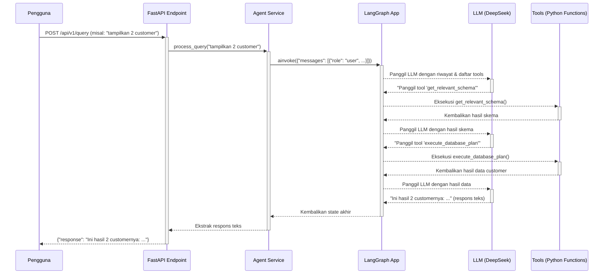

### **Dokumen Memori Proyek: Fase Database**
**Versi:** 1.0
**Tanggal:** 11 Juni 2025

#### **1. Instruksi untuk LLM Pengguna Dokumen Ini**
*   **Peran Anda:** Anda adalah AI Engineer yang melanjutkan proyek ini. Dokumen ini adalah sumber kebenaran utama Anda.
*   **Tugas Anda:**
    1.  Baca dan pahami seluruh dokumen ini untuk mendapatkan konteks penuh tentang apa yang telah dibangun.
    2.  Saat pengguna meminta Anda untuk memulai tugas baru (misal: "lanjutkan ke fase backend" atau "revisi fitur X"), **jangan langsung menulis kode**.
    3.  Tugas pertama Anda adalah **menganalisis permintaan tersebut dan membuat daftar file spesifik** yang Anda perlukan untuk menyelesaikan tugas itu. Gunakan "Peta File & Direktori" di bawah sebagai referensi.
    4.  Berikan daftar file yang Anda butuhkan kepada pengguna. Setelah pengguna memberikan isi dari file-file tersebut, barulah Anda boleh mulai menganalisis dan menulis kode.
*   **Panduan Revisi:** Saat melakukan revisi, selalu rujuk ke "Log Pembelajaran & Keputusan Desain" untuk memahami mengapa keputusan tertentu dibuat. Jika Anda mengusulkan perubahan, jelaskan dampaknya terhadap komponen lain berdasarkan "Diagram Ketergantungan Komponen".

#### **2. Ringkasan Fase & Status Saat Ini**
*   **Fase yang Didokumentasikan:** Database
*   **Tujuan Utama Fase Ini:** Membangun dan memvalidasi fondasi data yang terdiri dari database operasional MySQL (`sim_testgeluran`) dan *knowledge graph* Neo4j (`Graphiti`).
*   **Status Akhir:** SELESAI. Semua komponen database telah dibangun, diisi dengan data sampel, dan divalidasi secara end-to-end. Fondasi data siap untuk digunakan oleh backend.
*   **Komponen Utama yang Dihasilkan:**
    *   Database MySQL `sim_testgeluran` (untuk dev) & `sim_testgeluran_test` (untuk tes) yang skemanya sinkron dengan model ORM.
    *   Knowledge Graph Neo4j yang terisi dengan skema dan metadata semantik dari database MySQL.
    *   Serangkaian skrip utilitas untuk inisialisasi, validasi, dan migrasi skema.

#### **3. Peta File & Direktori yang Relevan**
*   **Struktur Direktori:**
    ```
    ai_agent_project_root/
    |
    ├── .env
    |
    ├── backend/
    │   ├── app/
    │   │   └── core/
    │   │       └── config.py
    │   └── mcp_servers/
    │       └── mysql_server/
    │           ├── alembic/
    │           │   ├── versions/
    │           │   │   └── xxxxx_initial_schema_from_models.py
    │           │   └── env.py
    │           ├── db_models/
    │           │   ├── __init__.py
    │           │   ├── base.py
    │           │   └── orm_*.py
    │           └── alembic.ini
    |
    ├── data_samples/
    │   ├── data.sql
    │   ├── graphiti_semantic_mapping.json
    │   └── schema_export.txt
    │
    └── scripts/
        ├── initialize_db_mysql.py
        ├── sync_mysql_to_graphiti.py
        └── validate_orm_models.py
    ```
*   **Deskripsi File Kunci:**
    *   `backend/mcp_servers/mysql_server/db_models/orm_*.py`: Mendefinisikan setiap tabel database sebagai kelas Python menggunakan SQLAlchemy ORM. Ini adalah "cetak biru" digital dari database.
    *   `backend/mcp_servers/mysql_server/db_models/__init__.py`: Mengimpor semua kelas ORM agar dapat diakses sebagai satu paket (`db_models`).
    *   `data_samples/schema_export.txt`: Referensi tekstual dari skema database asli. Digunakan untuk validasi manual terhadap model ORM.
    *   `data_samples/data.sql`: Berisi perintah SQL `INSERT` untuk mengisi database development dengan data sampel yang representatif dan konsisten.
    *   `scripts/initialize_db_mysql.py`: Skrip untuk membuat skema database dari model ORM dan mengisinya dengan data dari `data.sql`.
    *   `scripts/validate_orm_models.py`: Skrip pengujian untuk memvalidasi model ORM (CRUD) terhadap database tes yang bersih.
    *   `data_samples/graphiti_semantic_mapping.json`: "Otak" dari *knowledge graph*. File JSON ini memperkaya skema teknis dengan konteks bisnis (tujuan tabel, klasifikasi kolom, relasi).
    *   `scripts/sync_mysql_to_graphiti.py`: Skrip yang membaca pemetaan semantik dan membangun *knowledge graph* di Neo4j.
    *   `backend/mcp_servers/mysql_server/alembic/`: Direktori yang berisi konfigurasi dan skrip migrasi Alembic untuk mengelola perubahan skema database di masa depan.

#### **4. Diagram Ketergantungan Komponen**
*   **Deskripsi:** Aliran kerja dan ketergantungan antar file dalam fase ini.
    *   `schema_export.txt` -> menjadi acuan untuk -> `orm_*.py`.
    *   `orm_*.py` -> dibaca oleh -> `scripts/validate_orm_models.py` -> untuk menguji -> **Database Tes MySQL**.
    *   `orm_*.py` + `data.sql` -> digunakan oleh -> `scripts/initialize_db_mysql.py` -> untuk mengisi -> **Database Dev MySQL**.
    *   `graphiti_semantic_mapping.json` -> digunakan oleh -> `scripts/sync_mysql_to_graphiti.py` -> untuk mengisi -> **Database Neo4j**.
    *   `orm_*.py` -> dibaca oleh -> `alembic` -> untuk membuat skrip migrasi skema.
    *   `.env` -> dibaca oleh -> `backend/app/core/config.py` -> digunakan oleh -> semua skrip di atas.

#### **5. Log Pembelajaran & Keputusan Desain**
*   **Deskripsi:** Catatan tentang masalah yang dihadapi, solusi yang diterapkan, dan keputusan desain penting yang dibuat selama fase ini.
*   **Daftar Pelajaran:**
    *   **Masalah 1:** `ImportError: cannot import name 'Arbook'`.
        *   **Penyebab:** File `db_models/__init__.py` tidak secara eksplisit mengekspos kelas-kelas ORM.
        *   **Solusi:** Merevisi `__init__.py` untuk secara eksplisit mengimpor semua model (`from .orm_a_e import *`, dst.). Ini adalah praktik standar untuk membuat paket Python yang isinya dapat diakses dari luar.
    *   **Masalah 2:** `IntegrityError: a foreign key constraint fails`.
        *   **Penyebab:** Mencoba memasukkan data "anak" (`Mastercustomer`) sebelum data "induk" (`Masterpricelisttype`) ada di database.
        *   **Solusi:** Merevisi skrip validasi dan `data.sql` untuk memastikan data master/induk dibuat terlebih dahulu. Ini menekankan pentingnya urutan dalam *seeding* data relasional.
    *   **Masalah 3:** `DataError: Data too long for column`.
        *   **Penyebab:** Data sampel (misal: `'RETAIL'`) tidak sesuai dengan batasan skema (`VARCHAR(5)`).
        *   **Solusi:** Selalu validasi data sampel terhadap skema yang sebenarnya (`schema_export.txt`). Mengubah data agar sesuai (misal: menjadi `'RTL'`).
    *   **Masalah 4:** `TypeError` & `AttributeError` saat menjalankan Alembic.
        *   **Penyebab:** Kesalahan konfigurasi pada file `alembic/env.py` dalam meneruskan `target_metadata` dan URL database ke *context* Alembic.
        *   **Solusi:** Memperbaiki cara `context.configure()` dan `engine_from_config()` dipanggil untuk memastikan konfigurasi dari `config.py` digunakan dengan benar.
    *   **Keputusan Desain 1:** Menggunakan Alembic untuk Manajemen Skema.
        *   **Alasan:** Untuk mengelola evolusi skema di masa depan secara terprogram dan aman, menghindari perubahan manual yang berisiko. Ini adalah praktik terbaik industri.
    *   **Keputusan Desain 2:** Inisialisasi Database Berbasis ORM (`Base.metadata.create_all`).
        *   **Alasan:** Menggunakan model ORM sebagai satu-satunya sumber kebenaran (Single Source of Truth) untuk struktur database, bukan file `.sql`. Ini menjamin sinkronisasi 100% antara kode aplikasi dan skema database.

---

Tentu. Sesuai rencana baru yang telah kita sepakati, berikut adalah **Bab 1** dari `backend_memory.md` yang fokus pada arsitektur *tool calling* kita yang final.

---

### **Dokumen Memori Proyek: Fase Backend**
**Versi:** 2.0 (Arsitektur Tool Calling)
**Tanggal:** 12 Juni 2025

### **Bab 1: Arsitektur Backend & Alur Kerja Tool Calling**

#### **1. Instruksi untuk LLM Pengguna Dokumen Ini**
*   **Peran Anda:** Anda adalah AI Engineer yang melanjutkan proyek ini. Dokumen ini adalah sumber kebenaran utama Anda.
*   **Tugas Anda:**
    1.  Baca dan pahami seluruh dokumen ini untuk mendapatkan konteks penuh tentang apa yang telah dibangun.
    2.  Saat pengguna meminta Anda untuk memulai tugas baru, tugas pertama Anda adalah menganalisis permintaan tersebut dan membuat daftar file spesifik yang Anda perlukan untuk menyelesaikan tugas itu, berdasarkan "Peta File & Direktori" di bab berikutnya.
    3.  Setelah pengguna memberikan file-file yang relevan, barulah Anda boleh mulai menganalisis dan menulis kode.
*   **Panduan Revisi:** Rujuk ke dokumen ini untuk memahami arsitektur dan alur kerja saat ini sebelum melakukan perubahan.

#### **2. Ringkasan Arsitektur**
Arsitektur backend final untuk MVP ini dirancang dengan prinsip **kesederhanaan dan keandalan**. Setelah melalui beberapa iterasi, diputuskan untuk beralih dari arsitektur multi-proses berbasis MCP ke arsitektur proses tunggal yang menggunakan pola **tool calling** secara langsung.

Sistem ini terdiri dari tiga lapisan utama:
1.  **Lapisan API (FastAPI):** Bertindak sebagai gerbang masuk untuk semua permintaan dari klien (frontend).
2.  **Lapisan Layanan (Agent Service):** Berfungsi sebagai jembatan, menerima data dari API dan mengorkestrasi alur kerja agent.
3.  **Lapisan Agent (LangGraph):** Merupakan inti dari sistem. Ini adalah sebuah *state machine* yang secara dinamis memutuskan apakah perlu memanggil LLM untuk "berpikir" atau memanggil *tool* Python untuk "bertindak".

Pendekatan ini menghilangkan kerumitan komunikasi antar-proses dan memungkinkan debugging yang lebih mudah, sambil tetap mempertahankan pemisahan logika yang baik dengan menempatkan semua *tool* dalam direktori khusus.

#### **3. Diagram Alur Kerja**
Diagram berikut mengilustrasikan siklus hidup sebuah permintaan dalam arsitektur *tool calling* kita:



#### **4. Deskripsi Komponen Inti**

*   **FastAPI App (`main.py`, `endpoints/query.py`):**
    *   Bertanggung jawab untuk mengekspos endpoint HTTP.
    *   Hanya menangani validasi request/response dan mendelegasikan semua logika bisnis ke `Agent Service`.

*   **Agent Service (`services/agent_service.py`):**
    *   Perantara antara dunia HTTP dan dunia agent.
    *   Mempersiapkan `AgentState` awal yang dibutuhkan oleh LangGraph.
    *   Memanggil alur kerja LangGraph (`langgraph_app.ainvoke`).
    *   Setelah alur kerja selesai, ia bertugas mengekstrak respons akhir yang akan dikirim kembali ke pengguna.

*   **LangGraph App (`langgraph_workflow/graph.py`):**
    *   Ini adalah "papan sirkuit" dari agent.
    *   Menggunakan `StateGraph` untuk mendefinisikan *state machine* dua-node yang sangat efisien:
        1.  **`agent` (node `llm_caller`):** Bertugas memanggil LLM.
        2.  **`action` (node `tool_executor`):** Bertugas menjalankan *tool* Python.
    *   Mengelola alur bolak-balik antara "berpikir" (`agent`) dan "bertindak" (`action`) hingga tugas selesai.

*   **Direktori `tools/` (`database_tools.py`, `graphiti_tools.py`):**
    *   Ini adalah "kotak perkakas" dari agent.
    *   Setiap file berisi fungsi-fungsi Python biasa yang melakukan tugas-tugas spesifik (query database, query Neo4j).
    *   Fungsi-fungsi ini sepenuhnya terpisah dari LangGraph dan bisa diuji secara independen. Mereka tidak tahu bahwa mereka sedang dipanggil oleh sebuah agent.

---

Tentu. Sesuai rencana dan setelah memeriksa kembali struktur file akhir kita, berikut adalah **Bab 2** dari `backend_memory.md`.

---

### **Bab 2: Peta File & Komponen Kunci**

#### **1. Instruksi untuk LLM Pengguna Dokumen Ini**
*   **Peran Anda:** Anda adalah AI Engineer yang melanjutkan proyek ini. Dokumen ini adalah sumber kebenaran utama Anda.
*   **Tugas Anda:**
    1.  Baca dan pahami seluruh dokumen ini untuk mendapatkan konteks penuh tentang apa yang telah dibangun.
    2.  Saat pengguna meminta Anda untuk memulai tugas baru, tugas pertama Anda adalah menganalisis permintaan tersebut dan membuat daftar file spesifik yang Anda perlukan untuk menyelesaikan tugas itu, berdasarkan "Peta File & Direktori" ini.
    3.  Setelah pengguna memberikan file-file yang relevan, barulah Anda boleh mulai menganalisis dan menulis kode.
*   **Panduan Revisi:** Rujuk ke dokumen ini untuk memahami arsitektur dan alur kerja saat ini sebelum melakukan perubahan.

#### **2. Struktur Folder Final (Arsitektur Tool Calling)**
Struktur folder ini mencerminkan arsitektur akhir yang telah divalidasi, di mana logika MCP telah digantikan oleh direktori `tools` terpusat.

```
backend/
└── app/
    ├── api/
    │   └── v1/
    │       └── endpoints/
    │           └── query.py
    ├── core/
    │   └── config.py
    ├── db_models/
    │   ├── __init__.py
    │   ├── base.py
    │   └── (file-file orm_*.py)
    ├── langgraph_workflow/
    │   ├── graph.py
    │   └── nodes/
    │       ├── __init__.py
    │       ├── llm_caller.py
    │       └── tool_executor.py
    ├── schemas/
    │   └── agent_state.py
    ├── services/
    │   └── agent_service.py
    ├── tools/
    │   ├── __init__.py
    │   ├── database_tools.py
    │   └── graphiti_tools.py
    └── main.py
```

#### **3. Deskripsi File & Komponen Kunci**

*   **`tools/database_tools.py`**: Berisi semua tool yang berinteraksi dengan database MySQL.
    *   `execute_database_plan(payload: ExecutePlanInput)`: Fungsi utama yang menerima `DatabaseOperationPlan` dalam bentuk Pydantic model, membangun query menggunakan `DynamicQueryBuilder`, dan mengeksekusinya ke database.
    *   `DynamicQueryBuilder`: Kelas internal yang bertanggung jawab untuk menerjemahkan struktur JSON/Pydantic menjadi objek query SQLAlchemy 2.0 yang aman. Ini adalah "mesin penerjemah" dari rencana ke aksi.

*   **`tools/graphiti_tools.py`**: Berisi semua tool yang berinteraksi dengan knowledge graph Neo4j.
    *   `get_relevant_schema(payload: GetRelevantSchemaInput)`: Fungsi `async` yang melakukan query Cypher ke Neo4j untuk mengambil "peta data" (skema tabel dan relasi) yang relevan dengan permintaan pengguna.
    *   `store_session_data()` dan `retrieve_session_data()`: Fungsi `async` yang berfungsi sebagai "sistem loker", menyimpan dan mengambil data hasil query sementara di Neo4j untuk menjaga `AgentState` tetap ringan.

*   **`langgraph_workflow/nodes/llm_caller.py`**: "Otak" dari agent.
    *   `llm_caller_node(state: AgentState)`: Fungsi `async` ini menerima `state` (terutama riwayat percakapan), menyusun definisi dari semua *tool* yang tersedia secara manual, dan memanggil LLM API (DeepSeek). Ia mengembalikan respons dari LLM, yang bisa berupa pesan teks atau permintaan untuk memanggil satu atau lebih *tool*.

*   **`langgraph_workflow/nodes/tool_executor.py`**: "Tangan" dari agent.
    *   `tool_executor_node(state: AgentState)`: Fungsi `async` ini dipanggil jika `llm_caller_node` menghasilkan `tool_calls`. Ia memeriksa *tool* mana yang diminta, mem-parse argumennya, memanggil fungsi Python yang sesuai dari direktori `tools/`, dan mengembalikan hasilnya dalam format `ToolMessage` yang standar.

*   **`langgraph_workflow/graph.py`**: "Papan Sirkuit" dari agent.
    *   Merakit `StateGraph` dengan hanya dua node utama: `agent` (yang menunjuk ke `llm_caller_node`) dan `action` (yang menunjuk ke `tool_executor_node`).
    *   Mendefinisikan alur kondisional: setelah `agent` berjalan, periksa apakah ada `tool_calls`. Jika ada, pergi ke `action`. Jika tidak, alur selesai (`END`). Setelah `action` berjalan, alur selalu kembali ke `agent`.

*   **`services/agent_service.py`**: "Manajer" dari agent.
    *   `process_query(user_query: str, session_id: str)`: Fungsi `async` yang menjadi jembatan antara API dan LangGraph. Ia membuat `AgentState` awal dengan pesan pengguna, memanggil `langgraph_app.ainvoke()` untuk menjalankan seluruh alur kerja, dan kemudian mengekstrak respons teks final dari *state* akhir untuk dikembalikan ke API.

*   **`schemas/agent_state.py`**: "Memori Jangka Pendek" agent.
    *   `AgentState(TypedDict)`: Disederhanakan menjadi sebuah `TypedDict` yang hanya berisi field-field esensial yang dibutuhkan oleh alur kerja manual kita, seperti `chat_history: List[Dict[str, Any]]` dan `tool_calls`. Ini memberi kita kontrol penuh atas state.

---

Tentu. Sesuai rencana dan setelah memeriksa kembali status akhir proyek kita, berikut adalah **Bab 3** dari `backend_memory.md`.

---

### **Bab 3: Pengujian, Isu yang Diketahui, dan Langkah Selanjutnya**

#### **1. Instruksi untuk LLM Pengguna Dokumen Ini**
*   **Peran Anda:** Anda adalah AI Engineer yang melanjutkan proyek ini. Dokumen ini adalah sumber kebenaran utama Anda.
*   **Tugas Anda:**
    1.  Baca dan pahami seluruh dokumen ini untuk mendapatkan konteks penuh tentang apa yang telah dibangun.
    2.  Saat pengguna meminta Anda untuk memulai tugas baru, tugas pertama Anda adalah menganalisis permintaan tersebut dan membuat daftar file spesifik yang Anda perlukan untuk menyelesaikan tugas itu, berdasarkan "Peta File & Direktori" di bab sebelumnya.
    3.  Setelah pengguna memberikan file-file yang relevan, barulah Anda boleh mulai menganalisis dan menulis kode.
*   **Panduan Revisi:** Rujuk ke dokumen ini untuk memahami arsitektur dan alur kerja saat ini sebelum melakukan perubahan.

#### **2. Strategi Pengujian**
Arsitektur *tool calling* yang diadopsi memungkinkan strategi pengujian yang terstruktur dan berlapis:

1.  **Unit Test untuk Tools (Sangat Direkomendasikan):**
    *   **Tujuan:** Memvalidasi logika internal dari setiap fungsi *tool* secara terisolasi, tanpa melibatkan LangGraph atau LLM.
    *   **Contoh:** Membuat skrip tes yang mengimpor `DynamicQueryBuilder` dari `database_tools.py` dan memverifikasi bahwa ia menghasilkan SQL yang benar dari `DatabaseOperationPlan` sampel. Ini memastikan "tangan" agent bekerja dengan benar.
    *   **Lokasi:** Idealnya di dalam direktori `backend/tests/unit/`.

2.  **Tes Integrasi Terisolasi untuk Panggilan LLM:**
    *   **Tujuan:** Memvalidasi bahwa prompt dan panggilan API langsung ke LLM berfungsi seperti yang diharapkan.
    *   **Contoh:** Skrip `scripts/test_llm_call.py` yang kita buat adalah contoh sempurna. Ia menguji `llm_caller_node` secara terisolasi untuk memastikan ia bisa mendapatkan JSON yang valid dari LLM. Ini memastikan "otak" agent bisa berkomunikasi.

3.  **Tes End-to-End (E2E) untuk Alur Kerja Penuh:**
    *   **Tujuan:** Memvalidasi seluruh sistem dari API hingga respons akhir.
    *   **Contoh:** Skrip `scripts/test_e2e_phase3.py` (yang bisa dinamai ulang menjadi `test_agent_e2e.py`) adalah implementasi dari tes ini.
    *   **Cara Kerja:**
        a. Menjalankan server FastAPI utama dengan `uvicorn`.
        b. Skrip tes bertindak sebagai klien HTTP, memanggil endpoint `/api/v1/query`.
        c. Memvalidasi bahwa respons akhir yang diterima sesuai dengan yang diharapkan.
    *   **Lokasi Skrip Pengujian:** `scripts/test_e2e_phase3.py`

#### **3. Isu yang Diketahui (Known Issues)**
Bagian ini sangat penting untuk pengembangan selanjutnya. Ini adalah daftar perilaku yang belum sempurna pada akhir fase backend.

*   **Isu Prioritas #1: Respons "No Content" atau Kosong.**
    *   **Gejala:** Setelah beberapa siklus pemanggilan *tool*, respons akhir yang diterima oleh klien adalah string kosong atau pesan default seperti "No content from agent."
    *   **Penyebab:** Logika di `agent_service.py` saat ini terlalu naif. Ia hanya mengambil konten dari **pesan terakhir** di `chat_history`. Jika pesan terakhir itu adalah hasil dari `tool_executor_node` (yang kontennya berupa JSON data) atau pesan `assistant` yang hanya berisi `tool_calls` (dengan `content` kosong), maka respons yang dikirim ke pengguna akan salah atau kosong.
    *   **Rencana Perbaikan:** Merevisi `agent_service.py` atau `graph.py`. Perlu ada logika yang lebih cerdas untuk menelusuri riwayat pesan dan menemukan pesan `assistant` terakhir yang **tidak memiliki `tool_calls`**, karena itulah respons teks yang sebenarnya ditujukan untuk pengguna.

*   **Isu #2: Belum Ada Implementasi *Placeholder Strategy*.**
    *   **Gejala:** Agent saat ini dapat melihat dan mengembalikan angka finansial secara langsung dalam narasinya, yang bertentangan dengan prinsip desain awal kita (`Zero Manual Calculation by LLM`).
    *   **Rencana Perbaikan:** Setelah Isu #1 diselesaikan, langkah berikutnya adalah mengimplementasikan *placeholder*. Ini kemungkinan akan melibatkan pembuatan node baru di LangGraph yang berjalan setelah `tool_executor` untuk mengganti angka dengan placeholder (misalnya, `{TOTAL_SALES}`) sebelum dikirim kembali ke `llm_caller`.

*   **Isu #3: Penanganan Error yang Belum Sempurna.**
    *   **Gejala:** Jika sebuah *tool* gagal (misal, `execute_database_plan` gagal karena query salah), pesan error teknis dari Python akan dikirim kembali ke LLM. LLM mungkin akan bingung atau mengulang pesan error tersebut ke pengguna.
    *   **Rencana Perbaikan:** Perlu ada logika di dalam `tool_executor_node` atau node baru untuk "menangkap" error teknis dan mengubahnya menjadi pesan yang lebih netral dan dapat dimengerti oleh LLM, seperti `"Tool execution failed. Please check the plan and try again."`

#### **4. Langkah Selanjutnya**
Berdasarkan status saat ini, prioritas pengembangan berikutnya adalah:
1.  **Memperbaiki Isu Prioritas #1:** Menyelesaikan masalah respons "No Content" agar agent selalu memberikan jawaban yang relevan kepada pengguna.
2.  **Implementasi *Placeholder Strategy*:** Membangun mekanisme untuk mencegah LLM melihat atau memanipulasi angka finansial.
3.  **Pengembangan Frontend:** Memulai pembangunan antarmuka pengguna (UI/UX) sesuai dengan dokumen perencanaan, yang akan berinteraksi dengan API backend yang kini sudah stabil.

---
