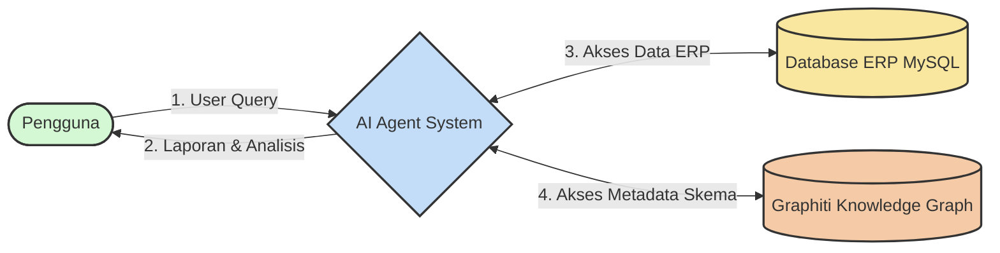

Baik, mari kita buat **Dokumen Arsitektur Data dan Aliran Data (Data Flow Diagram)**.

Dokumen ini akan membantu memvisualisasikan bagaimana data bergerak melalui sistem AI Agent Anda, dari input pengguna hingga output final, serta interaksi antar komponen utama.

---

**Dokumen Perencanaan Tambahan 3: Arsitektur Data dan Aliran Data**

**Versi Dokumen**: 1.0
**Tanggal**: 23 Oktober 2024

**Daftar Isi**:
1.  Pendahuluan
2.  Komponen Utama Sistem
3.  Diagram Aliran Data (DFD)
    3.1. DFD Level 0: Diagram Konteks Sistem
    3.2. DFD Level 1: Diagram Proses Utama AI Agent
4.  Penyimpanan Data Utama (Data Stores)
5.  Deskripsi Aliran Data Detail

---

**1. Pendahuluan**

Dokumen ini menjelaskan arsitektur data dan aliran data (Data Flow Diagram - DFD) untuk sistem MVP AI Agent. Tujuannya adalah untuk memberikan pemahaman visual tentang bagaimana informasi diproses, disimpan, dan ditransfer antar berbagai komponen sistem. Ini penting untuk memahami interdependensi antar modul dan memastikan integritas data.

---

**2. Komponen Utama Sistem**

Sistem AI Agent terdiri dari beberapa komponen utama yang saling berinteraksi:

1.  **Pengguna (User)**: Entitas eksternal yang berinteraksi dengan sistem melalui antarmuka pengguna.
2.  **Frontend (React.js)**: Antarmuka pengguna grafis tempat pengguna memasukkan query dan melihat hasil.
3.  **Backend API Server (FastAPI)**: Menerima permintaan dari Frontend, meneruskannya ke LangGraph Workflow, dan mengirimkan kembali respons.
4.  **LangGraph Workflow (AI Agent Core)**: Otak dari sistem, mengorkestrasi serangkaian node (proses) untuk memproses query pengguna.
    *   Node-node internal: `understand_query`, `consult_schema`, `plan_execution`, `execute_query`, `validate_results`, `replace_placeholders`, `generate_error_response`.
5.  **MCP Server untuk Graphiti (`graphiti_mcp_server`)**: Menyediakan layanan untuk mengakses metadata skema dari Graphiti Knowledge Graph.
6.  **MCP Server untuk MySQL (`mysql_mcp_server`)**: Menyediakan layanan untuk mengeksekusi query SQL ke Database ERP.
7.  **MCP Server untuk Placeholder System (`placeholder_mcp_server`)**: Menyediakan layanan untuk memformat output narasi.
8.  **Graphiti Knowledge Graph**: Penyimpanan data terstruktur untuk metadata skema database (definisi tabel, kolom, relasi, semantik).
9.  **Database ERP (MySQL)**: Sumber data operasional utama perusahaan (dalam MVP, disimulasikan dengan SQLite in-memory dari SQL source file).

---

**3. Diagram Aliran Data (DFD)**

**3.1. DFD Level 0: Diagram Konteks Sistem**



*   **Deskripsi Aliran Data Level 0**:
    1.  **User Query**: Pengguna memasukkan pertanyaan dalam bahasa alami.
    2.  **Laporan & Analisis**: Sistem AI Agent memberikan hasil analisis, narasi, dan tabel data.
    3.  **Akses Data ERP**: Sistem AI Agent membaca data transaksi dan operasional dari Database ERP.
    4.  **Akses Metadata Skema**: Sistem AI Agent membaca metadata skema dari Graphiti Knowledge Graph.

**3.2. DFD Level 1: Diagram Proses Utama AI Agent**

```mermaid
graph TD
    User([Pengguna]) -->|A. User Query| Frontend[Frontend React.js];
    Frontend -->|B. API Request (Query)| BackendAPI[Backend API FastAPI];
    BackendAPI -->|C. Proses Query| LangGraphWorkflow[LangGraph Workflow];

    subgraph LangGraphWorkflow
        direction LR
        N1[Node: understand_query] --> N2[Node: consult_schema];
        N2 --> N3[Node: plan_execution];
        N3 --> N4[Node: execute_query];
        N4 --> N5[Node: validate_results];
        N5 --> N6[Node: replace_placeholders];
        N6 -->|F. Hasil Final Terformat| BackendAPI;
        
        %% Jalur Error
        N1 -->|E1. Error NLU| NE[Node: generate_error_response];
        N2 -->|E2. Error Skema| NE;
        N3 -->|E3. Error Planning| NE;
        N4 -->|E4. Error Eksekusi SQL| NE;
        N5 -->|E5. Error Validasi| NE;
        N6 -->|E6. Error Formatting| NE;
        NE -->|G. Respons Error| BackendAPI;
    end

    N2 <-->|D1. Request Skema Relevan / Respons Skema| MCP_Graphiti[MCP Server: Graphiti];
    MCP_Graphiti <-->|D2. Baca Metadata| GraphitiDB[(Graphiti KG)];
    
    N4 <-->|D3. Request Eksekusi SQL / Respons Hasil SQL| MCP_MySQL[MCP Server: MySQL];
    MCP_MySQL <-->|D4. Query Data| ERP_DB[(Database ERP MySQL)];

    N6 <-->|D5. Request Isi Placeholder / Respons Narasi Final| MCP_Placeholder[MCP Server: Placeholder];

    BackendAPI -->|H. API Response (Hasil / Error)| Frontend;
    Frontend -->|I. Tampilan Laporan & Analisis / Pesan Error| User;

    %% Styling
    style User fill:#d3f8d3,stroke:#333,stroke-width:2px
    style Frontend fill:#e8daef,stroke:#333,stroke-width:2px
    style BackendAPI fill:#e8daef,stroke:#333,stroke-width:2px
    style LangGraphWorkflow fill:#c3ddf9,stroke:#333,stroke-width:2px
    style N1 fill:#e1effa,stroke:#333,stroke-width:1px
    style N2 fill:#e1effa,stroke:#333,stroke-width:1px
    style N3 fill:#e1effa,stroke:#333,stroke-width:1px
    style N4 fill:#e1effa,stroke:#333,stroke-width:1px
    style N5 fill:#e1effa,stroke:#333,stroke-width:1px
    style N6 fill:#e1effa,stroke:#333,stroke-width:1px
    style NE fill:#fadbd8,stroke:#c0392b,stroke-width:1px
    style MCP_Graphiti fill:#fdebd0,stroke:#333,stroke-width:1px
    style MCP_MySQL fill:#fdebd0,stroke:#333,stroke-width:1px
    style MCP_Placeholder fill:#fdebd0,stroke:#333,stroke-width:1px
    style GraphitiDB fill:#f5cba7,stroke:#333,stroke-width:2px
    style ERP_DB fill:#f9e79f,stroke:#333,stroke-width:2px
```

*   **Deskripsi Aliran Data Level 1**:
    *   **A. User Query**: Pengguna memasukkan query melalui Frontend.
    *   **B. API Request (Query)**: Frontend mengirimkan query pengguna dan `session_id` ke Backend API.
    *   **C. Proses Query**: Backend API memicu LangGraph Workflow dengan state awal.
        *   **Internal LangGraph**: Data mengalir melalui node-node (`N1` s/d `N6`) sesuai logika yang didefinisikan. Setiap node memodifikasi atau menambahkan data ke `AgentState`.
    *   **D1. Request Skema Relevan / Respons Skema**: Node `consult_schema` (N2) berkomunikasi dengan `MCP Server: Graphiti` untuk mendapatkan informasi skema.
    *   **D2. Baca Metadata**: `MCP Server: Graphiti` membaca data metadata dari `Graphiti Knowledge Graph`.
    *   **D3. Request Eksekusi SQL / Respons Hasil SQL**: Node `execute_query` (N4) berkomunikasi dengan `MCP Server: MySQL` untuk menjalankan query SQL.
    *   **D4. Query Data**: `MCP Server: MySQL` mengeksekusi query ke `Database ERP MySQL`.
    *   **D5. Request Isi Placeholder / Respons Narasi Final**: Node `replace_placeholders` (N6) berkomunikasi dengan `MCP Server: Placeholder` untuk memformat narasi.
    *   **F. Hasil Final Terformat**: Jika sukses, LangGraph Workflow (melalui node N6) mengembalikan hasil akhir ke Backend API. Ini berisi `final_narrative`, `data_table_for_display`, dll.
    *   **E1-E6. Error**: Jika terjadi error di salah satu node, aliran dialihkan ke `Node: generate_error_response` (NE).
    *   **G. Respons Error**: Node NE mengembalikan respons error terstruktur ke Backend API.
    *   **H. API Response (Hasil / Error)**: Backend API mengirimkan respons (sukses atau error) kembali ke Frontend.
    *   **I. Tampilan Laporan & Analisis / Pesan Error**: Frontend menampilkan hasil kepada pengguna atau pesan error yang sesuai.

---

**4. Penyimpanan Data Utama (Data Stores)**

1.  **State LangGraph (In-memory/Persistent)**:
    *   **Deskripsi**: Menyimpan `AgentState` yang aktif selama pemrosesan satu query. Untuk MVP, ini bisa jadi in-memory. Untuk produksi, bisa menggunakan checkpointer LangGraph ke database persisten (misalnya Redis, Postgres).
    *   **Data yang Disimpan**: Seluruh `AgentState` (lihat Dokumen Perencanaan Tambahan 2).
    *   **Digunakan oleh**: Semua node dalam LangGraph Workflow.

2.  **Database ERP (MySQL)**:
    *   **Deskripsi**: Sumber data utama untuk analisis. Berisi data transaksional dan operasional perusahaan.
    *   **Data yang Disimpan**: Tabel-tabel seperti `sales_orders`, `order_lines`, `customers`, `products`, `employees`, dll.
    *   **Digunakan oleh**: `MCP Server: MySQL` (untuk membaca data).

3.  **Graphiti Knowledge Graph**:
    *   **Deskripsi**: Menyimpan metadata skema database ERP yang diperkaya dengan informasi semantik.
    *   **Data yang Disimpan**: Definisi tabel, kolom (beserta tipe, klasifikasi, deskripsi, kemampuan agregasi), relasi antar tabel, tujuan bisnis tabel.
    *   **Digunakan oleh**: `MCP Server: Graphiti` (untuk membaca metadata skema).

---

**5. Deskripsi Aliran Data Detail**

| ID Aliran | Nama Aliran Data                     | Sumber                                      | Tujuan                                        | Deskripsi Data yang Mengalir (Contoh)                                                                                                |
| :-------- | :----------------------------------- | :------------------------------------------ | :-------------------------------------------- | :----------------------------------------------------------------------------------------------------------------------------------- |
| A         | User Query                           | Pengguna                                    | Frontend React.js                             | `{ "user_query": "Tunjukkan sales Januari 2023", "session_id": "user_123" }`                                                      |
| B         | API Request (Query)                  | Frontend React.js                           | Backend API FastAPI                           | (Sama seperti A)                                                                                                                     |
| C         | Proses Query (State Awal LangGraph)  | Backend API FastAPI                         | LangGraph Workflow                            | `AgentState` awal: `{ "user_query": "...", "session_id": "...", "conversation_history": [], ... }`                                   |
| D1        | Request Skema / Respons Skema        | Node `consult_schema`                       | MCP Server: Graphiti                          | Request: `{ "intent": "sales_analysis", "entities": ["sales"] }`. Response: `{ "relevant_tables": [...], ... }`                       |
| D2        | Baca Metadata                        | MCP Server: Graphiti                        | Graphiti Knowledge Graph                      | Query Cypher atau internal Graphiti untuk mengambil skema.                                                                             |
| D3        | Request Eksekusi SQL / Hasil SQL     | Node `execute_query`                        | MCP Server: MySQL                             | Request: `{ "sql_queries": ["SELECT ..."] }`. Response: `{ "batch_results": [{"query": "...", "results": [...]}] }`                |
| D4        | Query Data                           | MCP Server: MySQL                           | Database ERP MySQL                            | Actual SQL SELECT statements.                                                                                                        |
| D5        | Request Isi Placeholder / Narasi Final | Node `replace_placeholders`                 | MCP Server: Placeholder                       | Request: `{ "response_template": "...", "data_values": {...} }`. Response: `{ "final_narrative": "..." }`                            |
| F         | Hasil Final Terformat                | LangGraph Workflow (Node `replace_placeholders`) | Backend API FastAPI                           | `AgentState` akhir: `{ "final_narrative": "...", "data_table_for_display": [...], ...}`                                              |
| G         | Respons Error                        | LangGraph Workflow (Node `generate_error_response`) | Backend API FastAPI                           | `{ "success": false, "user_message": "...", ...}`                                                                                      |
| H         | API Response (Hasil / Error)         | Backend API FastAPI                         | Frontend React.js                             | (Sama seperti F atau G, ditambah data untuk UI monitoring jika ada)                                                                  |
| I         | Tampilan Laporan / Pesan Error       | Frontend React.js                           | Pengguna                                      | Tampilan visual dari narasi, tabel, ringkasan, atau pesan error.                                                                      |
| E1-E6     | Aliran Data Error Internal           | Node N1-N6                                  | Node `generate_error_response`                | `AgentState` saat error terjadi, ditambah `error_message_for_user`, `technical_error_details`.                                       |

---

Dokumen ini menyediakan gambaran umum tentang bagaimana data mengalir dan diproses dalam sistem AI Agent. Diagram dan deskripsi ini dapat digunakan sebagai acuan selama pengembangan dan untuk diskusi lebih lanjut mengenai detail implementasi setiap komponen.